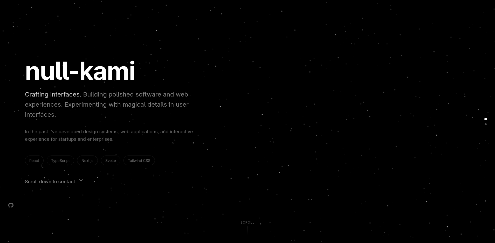
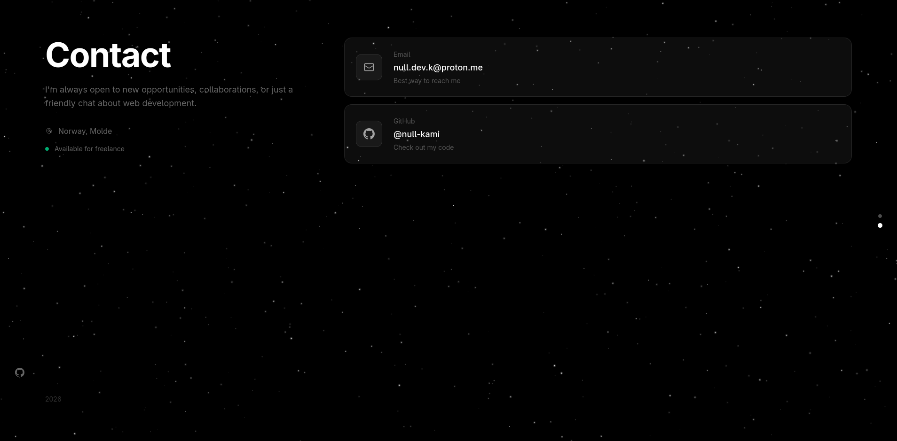

<div align='center'>
  
# null-kami - portfolio
[](https://svelte.dev)
[](https://kit.svelte.dev)
[](https://typescriptlang.org)
[](https://tailwindcss.com)

</div>

---


---

## Stack
 
| | |
|---|---|
| Framework | Svelte 5 + SvelteKit 2 |
| Language | TypeScript (strict) |
| Styling | Tailwind CSS v4 |
| Build | Vite 8 |
| Architecture | Feature-Sliced Design |
 
## Start
 
```bash
npm install
npm run dev
```

## Customize
 
All personal data lives in `src/shared/config/site.ts`.

<div align='center'>
    MIT
</div>
